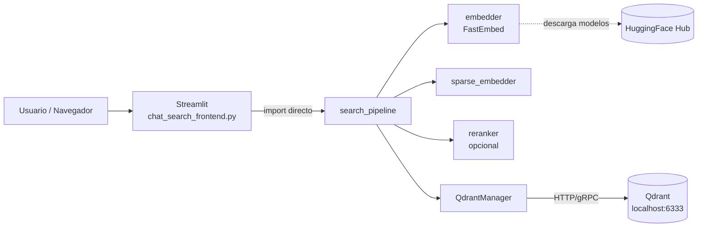
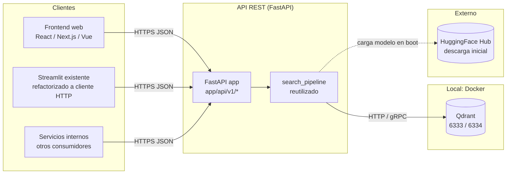
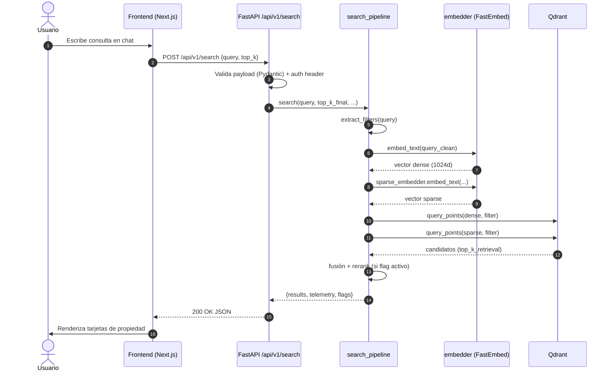
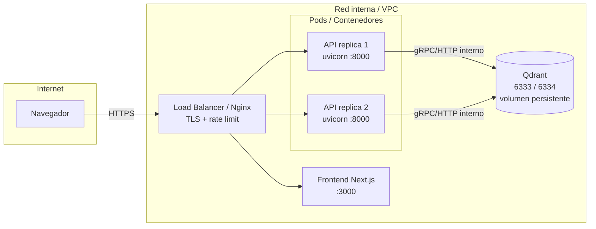

# Integración del acceso a Qdrant vía API REST

Este documento describe **cómo exponer el acceso a la base de datos vectorial
(Qdrant) a través de una API HTTP** que pueda ser consumida por cualquier
frontend (Streamlit actual, React/Next.js, Vue, móvil u otros sistemas
internos), reutilizando todo el motor de búsqueda semántica que ya existe en
`src/services/search_pipeline.py` y `src/db/client.py`.

El objetivo es **desacoplar el frontend del runtime Python**: hoy el frontend
de chat (`scripts/chat_search_frontend.py`) importa directamente
`search_pipeline` y `embedder`, lo que obliga al cliente a cargar FastEmbed,
descargar modelos de HuggingFace y tener acceso de red a Qdrant. Con la API
intermedia, el frontend sólo habla HTTP/JSON.

---

## 1. Estado actual vs. estado objetivo

### 1.1. Estado actual (acoplado)



Limitaciones:

- El frontend depende del intérprete Python y del modelo de embeddings cargado
  en memoria (RAM > 2 GB para `BAAI/bge-m3`).
- No se puede consumir desde una SPA, una app móvil o un servicio downstream.
- No hay control de autenticación, rate limiting ni versionado de contrato.

### 1.2. Estado objetivo (desacoplado vía API)



Beneficios:

- Un único servicio sirve a múltiples frontends.
- Los modelos se cargan **una sola vez** al arrancar la API (warm-up), no por
  cada cliente.
- Se puede escalar horizontalmente el servicio API detrás de un load balancer.
- Contrato versionado (`/api/v1/...`) y documentación OpenAPI gratuita.

---

## 2. Stack recomendado

| Capa | Tecnología recomendada | Justificación |
|------|------------------------|---------------|
| Framework HTTP | **FastAPI** | Async nativo, validación con Pydantic (ya usado por `config/settings.py`), OpenAPI/Swagger automático, latencia baja. |
| Servidor ASGI | **Uvicorn** (workers vía Gunicorn en prod) | Compatible con FastAPI y soportado por Docker. |
| Validación / serialización | **Pydantic v2** | Ya está en `requirements.txt`. |
| Autenticación | **API Key por header** (fase 1) → **JWT/OAuth2** (fase 2) | Mínimo viable primero, evolucionable. |
| Rate limiting | **slowapi** o reverse proxy (Nginx / Traefik) | Evitar abuso del modelo de embeddings. |
| Observabilidad | **loguru** (ya usado) + métricas Prometheus opcionales | Reutiliza la telemetría existente (`SearchTelemetry`). |
| Frontend nuevo (sugerido) | **Next.js + TypeScript + TanStack Query** | SSR/SPA, tipado fuerte del contrato, caché de queries. |

Alternativas razonables: **Flask + gunicorn** (más simple pero síncrono),
**LiteStar**, o **gRPC** si el consumidor también es un servicio interno.

---

## 3. Contrato de la API (v1)

Prefijo base: `/api/v1`. Todas las respuestas son `application/json`.
Documentación interactiva expuesta en `/docs` (Swagger UI) y `/redoc`.

### 3.1. `POST /api/v1/search` — búsqueda semántica

Request body:

```json
{
  "query": "casa en Buin con jardín, 4 dormitorios y menos de 6000 UF",
  "top_k": 5,
  "score_threshold": 0.0,
  "filters": {
    "comuna": "Buin",
    "precio_uf": { "lte": 6000 }
  }
}
```

Response body:

```json
{
  "query": "casa en Buin con jardín, 4 dormitorios y menos de 6000 UF",
  "query_clean": "casa en Buin con jardín",
  "filters": {
    "comuna": "Buin",
    "dormitorios": 4,
    "precio_uf": { "lte": 6000 }
  },
  "flags": {
    "two_stage": true,
    "cross_encoder": false,
    "hybrid_sparse_dense": true
  },
  "telemetry": {
    "parse_ms": 1.2,
    "embed_ms": 38.5,
    "retrieval_ms": 21.4,
    "rerank_ms": 12.0,
    "total_ms": 73.1
  },
  "results": [
    {
      "id": "9f0e...-uuid",
      "score": 0.812,
      "dense_score": 0.78,
      "sparse_score": 0.41,
      "rerank_score": 0.65,
      "payload": {
        "titulo": "Casa con jardín en Buin",
        "comuna": "Buin",
        "barrio": "Maipo",
        "precio_uf": 5800,
        "dormitorios": 4,
        "banios": 3,
        "m2_util": 120,
        "m2_total": 250,
        "tipo_propiedad": "casa",
        "operacion": "venta",
        "url": "https://...",
        "images": ["https://.../1.jpg", "https://.../2.jpg"],
        "descripcion": "..."
      }
    }
  ]
}
```

Notas:

- `filters` en el request es **opcional**: si no viene, la API delega la
  extracción de filtros al pipeline (`extract_filters` ya parsea UF,
  dormitorios, baños, m², comuna, barrio, etc. desde `query`).
- `top_k`, `score_threshold` y los feature flags toman como default lo
  configurado en `config/settings.py` (`top_k_final`, `score_threshold`,
  `enable_two_stage_ranking`, etc.).

### 3.2. `GET /api/v1/properties/{point_id}` — detalle por ID

Devuelve un punto de Qdrant por su ID (UUID). Útil para una página de detalle
en el frontend.

### 3.3. `GET /api/v1/properties?url=...` — lookup por URL

Equivalente a `scripts/check_property_by_url.py`. Permite al frontend
verificar si una URL pública ya está indexada y obtener su payload.

### 3.4. `GET /api/v1/health` — health check

```json
{ "status": "ok", "qdrant": "up", "embedding_model": "BAAI/bge-m3" }
```

Verifica conectividad con Qdrant (`client.get_collections()`) y que el modelo
de embeddings esté inicializado.

### 3.5. `GET /api/v1/config` — configuración pública

Expone configuración no sensible para que el frontend la muestre en su UI
(modelo activo, alias de colección, flags activos). Replica las `st.caption`
del sidebar actual de Streamlit.

```json
{
  "collection_alias": "real_estate_properties_current",
  "embedding_model": "BAAI/bge-m3",
  "top_k_default": 5,
  "top_k_retrieval": 100,
  "flags": {
    "two_stage": true,
    "cross_encoder": false,
    "hybrid_sparse_dense": true
  }
}
```

### 3.6. Errores

Formato uniforme:

```json
{
  "error": {
    "code": "QDRANT_UNAVAILABLE",
    "message": "No se pudo conectar a Qdrant",
    "details": "Connection refused on localhost:6333"
  }
}
```

Códigos HTTP relevantes:

| Código | Significado |
|--------|-------------|
| `200` | OK |
| `400` | Request inválido (query vacío, top_k fuera de rango) |
| `401` / `403` | API key faltante o inválida |
| `404` | `point_id` o URL no encontrados |
| `422` | Error de validación de Pydantic |
| `429` | Rate limit excedido |
| `503` | Qdrant o el modelo de embeddings no están disponibles |

---

## 4. Diagrama de secuencia (búsqueda end-to-end)



---

## 5. Estructura de archivos propuesta

Manteniendo lo existente y añadiendo el módulo `app/`:

```
utlz/
├── app/                         # NUEVO: servicio API
│   ├── __init__.py
│   ├── main.py                  # crea FastAPI(), incluye routers
│   ├── dependencies.py          # auth (API key), inyección de pipeline
│   ├── schemas.py               # Pydantic: SearchRequest, SearchResponse, etc.
│   └── api/
│       ├── __init__.py
│       └── v1/
│           ├── __init__.py
│           ├── search.py        # POST /search
│           ├── properties.py    # GET /properties/{id}, GET /properties?url=
│           ├── health.py        # GET /health
│           └── config.py        # GET /config
├── config/settings.py           # se extiende con API_KEY, CORS_ORIGINS, etc.
├── src/                         # SIN CAMBIOS — la API reutiliza estos módulos
│   ├── services/search_pipeline.py
│   ├── services/embedder.py
│   └── db/client.py
├── scripts/chat_search_frontend.py  # se refactoriza para llamar a la API
└── requirements.txt             # añadir fastapi, uvicorn[standard], slowapi
```

---

## 6. Esqueleto de implementación

### 6.1. Extender `config/settings.py`

Añadir al `ETLSettings` (o crear un `APISettings` separado):

```python
api_host: str = Field(default="0.0.0.0", description="Host del servicio API")
api_port: int = Field(default=8000, description="Puerto del servicio API")
api_key: Optional[str] = Field(default=None, description="API key requerida en header X-API-Key")
cors_origins: list[str] = Field(
    default_factory=lambda: ["http://localhost:3000"],
    description="Orígenes permitidos para CORS",
)
rate_limit_per_minute: int = Field(default=60, description="Requests por minuto por API key")
```

### 6.2. `app/schemas.py`

```python
from typing import Any
from pydantic import BaseModel, Field

class FilterValue(BaseModel):
    eq: Any | None = None
    lt: float | None = None
    lte: float | None = None
    gt: float | None = None
    gte: float | None = None

class SearchRequest(BaseModel):
    query: str = Field(min_length=1, max_length=500)
    top_k: int = Field(default=5, ge=1, le=50)
    score_threshold: float = Field(default=0.0, ge=0.0, le=1.0)
    filters: dict[str, Any] | None = None

class SearchHit(BaseModel):
    id: str
    score: float
    dense_score: float = 0.0
    sparse_score: float = 0.0
    rerank_score: float = 0.0
    payload: dict[str, Any]

class SearchResponse(BaseModel):
    query: str
    query_clean: str
    filters: dict[str, Any]
    flags: dict[str, bool]
    telemetry: dict[str, float]
    results: list[SearchHit]
```

### 6.3. `app/dependencies.py`

```python
from fastapi import Header, HTTPException, status
from config.settings import settings

async def require_api_key(x_api_key: str | None = Header(default=None)) -> None:
    if settings.api_key and x_api_key != settings.api_key:
        raise HTTPException(
            status_code=status.HTTP_401_UNAUTHORIZED,
            detail="API key inválida o ausente",
        )
```

### 6.4. `app/api/v1/search.py`

```python
from fastapi import APIRouter, Depends, HTTPException
from app.dependencies import require_api_key
from app.schemas import SearchRequest, SearchResponse
from src.services.search_pipeline import search_pipeline

router = APIRouter(prefix="/search", tags=["search"])

@router.post("", response_model=SearchResponse, dependencies=[Depends(require_api_key)])
async def search(req: SearchRequest) -> SearchResponse:
    try:
        result = search_pipeline.search(
            query=req.query,
            top_k_final=req.top_k,
            score_threshold=req.score_threshold,
        )
    except Exception as exc:
        raise HTTPException(status_code=503, detail=f"Pipeline error: {exc}")
    return SearchResponse(**result)
```

> Nota: `search_pipeline.search(...)` ya devuelve exactamente la estructura
> esperada (`query`, `query_clean`, `filters`, `flags`, `telemetry`,
> `results`). No hay que reescribir lógica de búsqueda.

### 6.5. `app/main.py`

```python
from contextlib import asynccontextmanager
from fastapi import FastAPI
from fastapi.middleware.cors import CORSMiddleware

from app.api.v1 import search, properties, health, config as config_router
from config.settings import settings
from src.services.embedder import embedder
from src.services.sparse_embedder import sparse_embedder

@asynccontextmanager
async def lifespan(_: FastAPI):
    embedder.model
    sparse_embedder.embed_text("warmup")
    yield

app = FastAPI(
    title="Semantic Search API",
    version="1.0.0",
    lifespan=lifespan,
)

app.add_middleware(
    CORSMiddleware,
    allow_origins=settings.cors_origins,
    allow_methods=["GET", "POST"],
    allow_headers=["*"],
)

app.include_router(search.router, prefix="/api/v1")
app.include_router(properties.router, prefix="/api/v1")
app.include_router(health.router, prefix="/api/v1")
app.include_router(config_router.router, prefix="/api/v1")
```

### 6.6. Levantar el servicio

```bash
uvicorn app.main:app --host 0.0.0.0 --port 8000 --reload
```

En producción:

```bash
gunicorn app.main:app -k uvicorn.workers.UvicornWorker -w 2 -b 0.0.0.0:8000
```

> Importante: el modelo de embeddings ocupa RAM por worker. Para `bge-m3` se
> recomienda **1–2 workers por instancia** y escalar horizontalmente.

---

## 7. Cliente desde el frontend

### 7.1. Refactor mínimo del Streamlit existente

`scripts/chat_search_frontend.py` deja de importar `search_pipeline` y pasa
a llamar a la API:

```python
import requests

API_URL = "http://localhost:8000/api/v1"
API_KEY = "..."

def _search_properties(query, top_k, score_threshold):
    r = requests.post(
        f"{API_URL}/search",
        headers={"X-API-Key": API_KEY},
        json={"query": query, "top_k": top_k, "score_threshold": score_threshold},
        timeout=30,
    )
    r.raise_for_status()
    return r.json()
```

El resto del archivo (render de tarjetas, carrusel de imágenes, historial
en `st.session_state`) no cambia, porque la **forma del JSON es la misma**
que devolvía `search_pipeline.search()`.

### 7.2. Frontend nuevo (Next.js + TypeScript)

```ts
// lib/api.ts
export type SearchRequest = {
  query: string;
  top_k?: number;
  score_threshold?: number;
};

export type SearchHit = {
  id: string;
  score: number;
  payload: {
    titulo?: string;
    comuna?: string;
    precio_uf?: number;
    dormitorios?: number;
    banios?: number;
    m2_total?: number;
    url?: string;
    images?: string[];
    descripcion?: string;
  };
};

export type SearchResponse = {
  query: string;
  filters: Record<string, unknown>;
  results: SearchHit[];
  telemetry: Record<string, number>;
};

export async function search(req: SearchRequest): Promise<SearchResponse> {
  const res = await fetch(`${process.env.NEXT_PUBLIC_API_URL}/search`, {
    method: "POST",
    headers: {
      "Content-Type": "application/json",
      "X-API-Key": process.env.NEXT_PUBLIC_API_KEY ?? "",
    },
    body: JSON.stringify(req),
  });
  if (!res.ok) throw new Error(`Search failed: ${res.status}`);
  return res.json();
}
```

Con TanStack Query:

```ts
const { data, isLoading } = useQuery({
  queryKey: ["search", query],
  queryFn: () => search({ query, top_k: 5 }),
  enabled: query.length > 0,
});
```

---

## 8. Seguridad

| Riesgo | Mitigación |
|--------|------------|
| Exposición de Qdrant directo a Internet | Qdrant siempre detrás de la API; no se expone su puerto 6333 públicamente. |
| Uso anónimo / abuso | API key obligatoria por header `X-API-Key`. En v2: JWT + roles. |
| Costo de embeddings por request | Rate limiting con `slowapi` (ej. 60 req/min/clave). |
| CORS abusivo | `CORSMiddleware` con lista blanca explícita en `settings.cors_origins`. |
| Inyección en filtros | `filters` se valida contra un schema Pydantic con claves permitidas (`comuna`, `barrio`, `precio_uf`, `dormitorios`, etc.). |
| Tamaño de query | `query` limitado a 500 caracteres en el schema. |
| Secrets en .env | `.env` ya está en `.gitignore`. La `API_KEY` se inyecta como variable de entorno en el contenedor. |

---

## 9. Despliegue

### 9.1. Dockerfile para la API

```dockerfile
FROM python:3.11-slim

WORKDIR /app

COPY requirements.txt .
RUN pip install --no-cache-dir -r requirements.txt fastapi "uvicorn[standard]" slowapi

COPY . .

EXPOSE 8000
CMD ["uvicorn", "app.main:app", "--host", "0.0.0.0", "--port", "8000"]
```

### 9.2. `docker-compose.yml` extendido

```yaml
services:
  qdrant:
    image: qdrant/qdrant:latest
    ports:
      - "6333:6333"
      - "6334:6334"
    volumes:
      - qdrant_storage:/qdrant/storage

  api:
    build:
      context: .
      dockerfile: Dockerfile.api
    environment:
      - QDRANT_HOST=qdrant
      - QDRANT_PORT=6333
      - API_KEY=${API_KEY}
      - CORS_ORIGINS=["http://localhost:3000"]
    depends_on:
      - qdrant
    ports:
      - "8000:8000"
    volumes:
      - ./models_cache:/app/models_cache

  frontend:
    build:
      context: ./frontend
    environment:
      - NEXT_PUBLIC_API_URL=http://localhost:8000/api/v1
      - NEXT_PUBLIC_API_KEY=${API_KEY}
    ports:
      - "3000:3000"
    depends_on:
      - api

volumes:
  qdrant_storage:
```

### 9.3. Diagrama de despliegue



---

## 10. Observabilidad

El pipeline ya genera `SearchTelemetry` (`parse_ms`, `embed_ms`,
`retrieval_ms`, `rerank_ms`, `total_ms`). En la API basta con:

1. Loguear cada request con `loguru`: `query`, `top_k`, `total_ms`, `n_results`,
   `api_key_hash` (no la key en claro).
2. Exponer `/metrics` con `prometheus-fastapi-instrumentator` si se quiere
   métrica por endpoint, p99 de latencia y tasa de errores.
3. Enviar trazas a OpenTelemetry (opcional) con spans por etapa del pipeline
   reutilizando los timestamps ya capturados.

---

## 11. Plan de implementación por fases

| Fase | Entregable | Notas |
|------|------------|-------|
| **F1 — MVP** | `POST /search`, `GET /health`, sin auth | Permite ya conectar un frontend nuevo en local. |
| **F2 — Hardening** | API key obligatoria, CORS, rate limiting, errores tipados | Listo para staging interno. |
| **F3 — Detalle** | `GET /properties/{id}`, `GET /properties?url=`, `GET /config` | Habilita páginas de detalle y UI de admin. |
| **F4 — Migración frontend** | Streamlit pasa a cliente HTTP + nuevo frontend Next.js | Ambos consumen la misma API. |
| **F5 — Producción** | Docker multi-stage, gunicorn workers, TLS, métricas Prometheus, logs centralizados | Despliegue tras LB. |
| **F6 — Avanzado** | JWT/OAuth2, paginación, búsqueda por imagen, cache de embeddings por query | Iteración sobre métricas reales. |

---

## 12. Resumen ejecutivo

- La API actúa como **fachada única** sobre `search_pipeline` y
  `QdrantManager`, sin reimplementar lógica de búsqueda.
- El frontend (cualquiera) **sólo habla JSON** vía `/api/v1`, sin necesidad
  de Python ni de modelos cargados en cliente.
- El refactor es **bajo riesgo**: el JSON devuelto por la API coincide con
  el `dict` que hoy retorna `search_pipeline.search()`, por lo que el
  Streamlit actual se adapta cambiando una sola función.
- Qdrant **nunca se expone directamente**: queda en la red interna detrás
  del servicio API, con su volumen persistente y los aliases de colección
  ya soportados (`real_estate_properties_current`).
