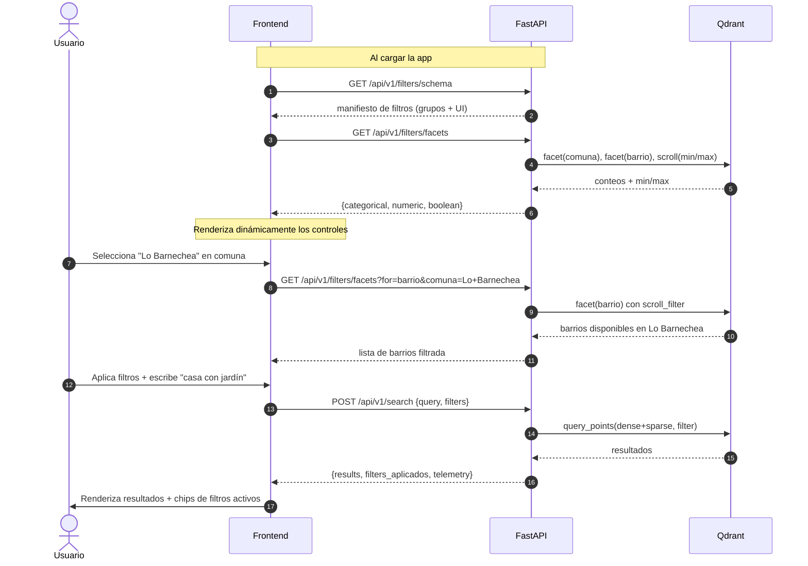

# Catálogo de filtros y descubrimiento dinámico desde el backend

Este documento responde a dos preguntas:

1. **¿Qué filtros se pueden aplicar a una propiedad además de la búsqueda
   semántica?** — Inventario exhaustivo extraído del payload real indexado
   en Qdrant (`src/etl/cleaner.py::prepare_metadata`) y de la lógica de
   extracción de filtros en lenguaje natural
   (`scripts/semantic_search.py::extract_filters`).
2. **¿Cómo debe exponer el backend ese catálogo para que el frontend se
   arme "a medida"?** — Diseño de los endpoints `GET /api/v1/filters/schema`
   y `GET /api/v1/filters/facets`, junto con el contrato JSON que consume
   el frontend para construir sus controles dinámicamente.

> Este documento complementa `docs/API_INTEGRATION.md`. Lo que aquí se
> describe es el conjunto **completo** de filtros que reemplaza al
> placeholder `filters: dict[str, Any]` del schema `SearchRequest`.

---

## 1. Origen de los filtros

Cada propiedad indexada en Qdrant tiene un `payload` con los siguientes
campos (definidos en `cleaner.prepare_metadata`):

```python
metadata = {
    "url", "portal", "tipo_propiedad", "operacion",
    "comuna", "barrio", "latitud", "longitud",
    "precio_uf", "m2_util", "m2_total",
    "dormitorios", "banios", "estacionamiento", "bodega",
    "anio", "piso", "gastos_comunes",
    "titulo", "descripcion",
    "niveles_propiedad", "tiene_piscina", "tiene_quincho",
    "tiene_jardin", "es_amoblado", "estado_propiedad",
    "images", "n_images",
}
```

Estos campos se dividen en tres familias:

- **Filtros explícitos**: campos sobre los que se puede filtrar
  directamente en Qdrant con `match` o `range`.
- **Campos descriptivos**: `titulo`, `descripcion` — alimentan al embedding
  y se devuelven en el payload, pero no se filtran (la búsqueda semántica
  ya los cubre).
- **Campos de visualización**: `url`, `images`, `latitud`, `longitud` —
  el frontend los usa para render; algunos pueden usarse como filtro
  (ej. geográfico) en fases futuras.

---

## 2. Catálogo completo de filtros

### 2.1. Categóricos — selección por valor exacto o lista

| Campo | Tipo | Valores observados | Control UI sugerido | Operadores | Origen |
|-------|------|--------------------|---------------------|------------|--------|
| `operacion` | enum string | `Venta`, `Arriendo` | Toggle / radio | `eq`, `in` | CSV |
| `tipo_propiedad` | enum string | `casa`, `departamento` | Toggle / radio | `eq`, `in` | CSV |
| `comuna` | string | Lo Barnechea, Las Condes, Providencia, Ñuñoa, Santiago, Buin, Colina, Chicureo, La Florida, Maipú, Puente Alto, Vitacura, La Reina, Macul, Peñalolén, Huechuraba, … | Multi-select con search | `eq`, `in` | CSV (facets) |
| `barrio` | string | Las Condes, Vitacura, Lo Barnechea, Providencia, Ñuñoa, Chicureo, Colina, Umbrales, La Dehesa, El Golf, San Damián, … | Multi-select con search (depende de comuna) | `eq`, `in` | CSV (facets) |
| `portal` | enum string | `Portal Inmobiliario`, … | Multi-select | `eq`, `in` | CSV |
| `estado_propiedad` | enum string | `nueva`, `remodelada`, `a_remodelar`, `desconocido` | Multi-select | `eq`, `in` | Derivado (texto + LLM opcional) |

> Los valores reales (lista actualizada de comunas/barrios/portales) los
> entrega el endpoint `GET /api/v1/filters/facets` — ver §4.

### 2.2. Numéricos enteros — rangos y exactos

| Campo | Tipo | Rango típico | Control UI sugerido | Operadores |
|-------|------|--------------|---------------------|------------|
| `dormitorios` | int | 0–10 | Stepper / range slider | `eq`, `gte`, `lte`, `in` |
| `banios` | int | 0–10 | Stepper / range slider | `eq`, `gte`, `lte`, `in` |
| `estacionamiento` | int | 0–10 | Stepper / "con estacionamiento" | `eq`, `gte`, `lte` |
| `bodega` | int | 0–5 | Stepper / "con bodega" | `eq`, `gte`, `lte` |
| `anio` | int | 1900–año actual | Range slider | `eq`, `gte`, `lte` |
| `piso` | int | 0–60 (departamento) | Range slider | `eq`, `gte`, `lte` |
| `niveles_propiedad` | int | 1, 2, 3 (sólo casas) | Toggle (1/2/3 pisos) | `eq`, `in` |
| `n_images` | int | 0–30 | Toggle "solo con fotos" (`gte: 1`) | `gte`, `lte` |

### 2.3. Numéricos decimales — rangos

| Campo | Tipo | Unidad | Rango típico | Control UI sugerido | Operadores |
|-------|------|--------|--------------|---------------------|------------|
| `precio_uf` | float | UF | 1 000–100 000 | Range slider con inputs | `gte`, `lte` |
| `m2_util` | float | m² | 20–1 000 | Range slider | `gte`, `lte` |
| `m2_total` | float | m² | 30–5 000 | Range slider | `gte`, `lte` |
| `gastos_comunes` | float | CLP | 0–2 000 000 | Range slider | `gte`, `lte` |
| `latitud` | float | grados | −55 a −17 | Bounding box (fase 2) | `geo_bounding_box`, `geo_radius` |
| `longitud` | float | grados | −109 a −66 | idem | idem |

> Para `latitud`/`longitud`, Qdrant soporta `GeoBoundingBox` y `GeoRadius`
> nativamente — habilitable en una fase posterior (ver §7).

### 2.4. Booleanos — checkboxes / toggles

| Campo | Tipo | UI sugerido | Origen |
|-------|------|-------------|--------|
| `tiene_piscina` | bool | Checkbox | Derivado (regex + LLM opcional) |
| `tiene_quincho` | bool | Checkbox | Derivado |
| `tiene_jardin` | bool | Checkbox | Derivado |
| `es_amoblado` | bool | Checkbox | Derivado |

### 2.5. Lookup exacto (no se exponen como filtro UI)

| Campo | Uso |
|-------|-----|
| `url` | `GET /api/v1/properties?url=...` para verificar si una publicación específica está indexada. |
| `images` | Render en frontend, no se usa como filtro. |
| `titulo`, `descripcion` | Alimentan el embedding y se devuelven en el payload. La búsqueda en estos campos se hace **vía semantic search**, no vía filtro exacto. |

---

## 3. Operadores soportados

La capa `QdrantManager.search_similar()` ya implementa los operadores de
abajo. Para cubrir todos los casos del UI (especialmente multi-select de
comunas), se propone extenderla con `in`:

| Operador | Significado | Implementación en Qdrant |
|----------|-------------|--------------------------|
| `eq` (valor escalar) | Igualdad exacta | `FieldCondition(match=MatchValue(value=v))` ✅ ya soportado |
| `in` | Pertenencia a lista | `FieldCondition(match=MatchAny(any=[...]))` ⚠️ **a añadir** |
| `lt` / `lte` / `gt` / `gte` | Rango numérico | `FieldCondition(range={...})` ✅ ya soportado |
| `geo_bounding_box` | Caja geográfica | `FieldCondition(geo_bounding_box=...)` 🟡 fase 2 |
| `geo_radius` | Radio desde punto | `FieldCondition(geo_radius=...)` 🟡 fase 2 |

### 3.1. Forma del objeto `filters` enviado por el frontend

```json
{
  "operacion": "Venta",
  "tipo_propiedad": "casa",
  "comuna": { "in": ["Lo Barnechea", "Las Condes", "Vitacura"] },
  "precio_uf": { "gte": 5000, "lte": 15000 },
  "m2_total": { "gte": 150 },
  "dormitorios": { "gte": 3, "lte": 5 },
  "banios": { "gte": 2 },
  "estacionamiento": { "gte": 1 },
  "bodega": { "gte": 1 },
  "anio": { "gte": 2015 },
  "niveles_propiedad": { "in": [1, 2] },
  "tiene_piscina": true,
  "tiene_jardin": true,
  "estado_propiedad": { "in": ["nueva", "remodelada"] },
  "n_images": { "gte": 1 }
}
```

Reglas:

- Valor escalar → match exacto (`eq`).
- Objeto con claves `gte`, `lte`, `gt`, `lt` → rango (combinables).
- Objeto con `in: [...]` → multi-valor (OR).
- Todos los filtros del objeto raíz se combinan con **AND**.

---

## 4. Endpoints de descubrimiento (para frontend "a medida")

El frontend **no debe** hardcodear la lista de comunas, los rangos de
precio ni los enums. El backend expone dos endpoints para que el frontend
se construya dinámicamente.

### 4.1. `GET /api/v1/filters/schema` — manifiesto estático

Devuelve la **definición** de cada filtro: clave, tipo, operadores
soportados, control de UI sugerido y label en español. **No** depende de
los datos actuales; es el "contrato" entre back y front.

```json
{
  "version": "1.0",
  "groups": [
    {
      "id": "ubicacion",
      "label": "Ubicación",
      "filters": [
        {
          "key": "comuna",
          "label": "Comuna",
          "type": "string",
          "ui": "multi_select",
          "operators": ["eq", "in"],
          "facetable": true,
          "depends_on": null
        },
        {
          "key": "barrio",
          "label": "Barrio",
          "type": "string",
          "ui": "multi_select",
          "operators": ["eq", "in"],
          "facetable": true,
          "depends_on": "comuna"
        }
      ]
    },
    {
      "id": "tipo_y_operacion",
      "label": "Tipo y operación",
      "filters": [
        {
          "key": "operacion",
          "label": "Operación",
          "type": "enum",
          "ui": "toggle",
          "operators": ["eq", "in"],
          "options": [
            {"value": "Venta", "label": "Venta"},
            {"value": "Arriendo", "label": "Arriendo"}
          ]
        },
        {
          "key": "tipo_propiedad",
          "label": "Tipo de propiedad",
          "type": "enum",
          "ui": "toggle",
          "operators": ["eq", "in"],
          "options": [
            {"value": "casa", "label": "Casa"},
            {"value": "departamento", "label": "Departamento"}
          ]
        }
      ]
    },
    {
      "id": "precio_y_superficie",
      "label": "Precio y superficie",
      "filters": [
        {
          "key": "precio_uf",
          "label": "Precio (UF)",
          "type": "number",
          "unit": "UF",
          "ui": "range_slider",
          "operators": ["gte", "lte"],
          "step": 100
        },
        {
          "key": "m2_util",
          "label": "Superficie útil",
          "type": "number",
          "unit": "m²",
          "ui": "range_slider",
          "operators": ["gte", "lte"],
          "step": 5
        },
        {
          "key": "m2_total",
          "label": "Superficie total",
          "type": "number",
          "unit": "m²",
          "ui": "range_slider",
          "operators": ["gte", "lte"],
          "step": 10
        },
        {
          "key": "gastos_comunes",
          "label": "Gastos comunes",
          "type": "number",
          "unit": "CLP",
          "ui": "range_slider",
          "operators": ["gte", "lte"],
          "step": 10000
        }
      ]
    },
    {
      "id": "habitaciones",
      "label": "Habitaciones",
      "filters": [
        {"key": "dormitorios", "label": "Dormitorios", "type": "integer", "ui": "stepper_range", "operators": ["eq", "gte", "lte"], "min": 0, "max": 10},
        {"key": "banios", "label": "Baños", "type": "integer", "ui": "stepper_range", "operators": ["eq", "gte", "lte"], "min": 0, "max": 10}
      ]
    },
    {
      "id": "comodidades",
      "label": "Comodidades",
      "filters": [
        {"key": "estacionamiento", "label": "Estacionamientos", "type": "integer", "ui": "stepper", "operators": ["eq", "gte"], "min": 0, "max": 10},
        {"key": "bodega", "label": "Bodegas", "type": "integer", "ui": "stepper", "operators": ["eq", "gte"], "min": 0, "max": 5},
        {"key": "tiene_piscina", "label": "Con piscina", "type": "boolean", "ui": "checkbox", "operators": ["eq"]},
        {"key": "tiene_quincho", "label": "Con quincho", "type": "boolean", "ui": "checkbox", "operators": ["eq"]},
        {"key": "tiene_jardin", "label": "Con jardín", "type": "boolean", "ui": "checkbox", "operators": ["eq"]},
        {"key": "es_amoblado", "label": "Amoblado", "type": "boolean", "ui": "checkbox", "operators": ["eq"]}
      ]
    },
    {
      "id": "antiguedad_y_piso",
      "label": "Antigüedad y piso",
      "filters": [
        {"key": "anio", "label": "Año de construcción", "type": "integer", "ui": "range_slider", "operators": ["gte", "lte"], "min": 1900, "max": 2026, "step": 1},
        {"key": "piso", "label": "Piso (solo departamentos)", "type": "integer", "ui": "range_slider", "operators": ["gte", "lte"], "min": 0, "max": 60, "depends_on": {"tipo_propiedad": "departamento"}},
        {"key": "niveles_propiedad", "label": "Niveles (solo casas)", "type": "enum", "ui": "toggle", "operators": ["eq", "in"], "options": [{"value": 1, "label": "1 piso"}, {"value": 2, "label": "2 pisos"}, {"value": 3, "label": "3 pisos"}], "depends_on": {"tipo_propiedad": "casa"}},
        {"key": "estado_propiedad", "label": "Estado", "type": "enum", "ui": "multi_select", "operators": ["eq", "in"], "options": [{"value": "nueva", "label": "Nueva"}, {"value": "remodelada", "label": "Remodelada"}, {"value": "a_remodelar", "label": "A remodelar"}, {"value": "desconocido", "label": "Sin información"}]}
      ]
    },
    {
      "id": "extras",
      "label": "Extras",
      "filters": [
        {"key": "portal", "label": "Portal de origen", "type": "string", "ui": "multi_select", "operators": ["eq", "in"], "facetable": true},
        {"key": "n_images", "label": "Solo con fotos", "type": "integer", "ui": "checkbox_as_gte", "operators": ["gte"], "checkbox_value": 1}
      ]
    }
  ]
}
```

El frontend recorre este JSON, agrupa los filtros por `group.id` y
renderiza un control por cada uno según `ui`. Esto evita cualquier
hardcoding de campos en el frontend.

### 4.2. `GET /api/v1/filters/facets` — valores reales disponibles

Devuelve los **valores efectivamente presentes** en la colección activa,
para poblar los selectores y mostrar los rangos reales (no hipotéticos)
de cada slider.

Request opcional:

```
GET /api/v1/filters/facets?for=comuna,barrio,precio_uf,m2_total
GET /api/v1/filters/facets?for=barrio&comuna=Lo+Barnechea
```

Response:

```json
{
  "categorical": {
    "comuna": [
      {"value": "Lo Barnechea", "count": 1234},
      {"value": "Las Condes", "count": 980},
      {"value": "Vitacura", "count": 612}
    ],
    "barrio": [
      {"value": "La Dehesa", "count": 410},
      {"value": "El Golf", "count": 305}
    ],
    "operacion": [
      {"value": "Venta", "count": 4200},
      {"value": "Arriendo", "count": 800}
    ],
    "tipo_propiedad": [
      {"value": "casa", "count": 2800},
      {"value": "departamento", "count": 2200}
    ],
    "portal": [{"value": "Portal Inmobiliario", "count": 5000}],
    "estado_propiedad": [
      {"value": "nueva", "count": 320},
      {"value": "remodelada", "count": 180},
      {"value": "a_remodelar", "count": 90},
      {"value": "desconocido", "count": 4410}
    ]
  },
  "numeric": {
    "precio_uf":      {"min": 1500,  "max": 95000, "p10": 4500, "p50": 12000, "p90": 35000},
    "m2_util":        {"min": 25,    "max": 850,   "p10": 55,   "p50": 120,   "p90": 320},
    "m2_total":       {"min": 30,    "max": 4200,  "p10": 65,   "p50": 180,   "p90": 600},
    "dormitorios":    {"min": 0,     "max": 8,     "p50": 3},
    "banios":         {"min": 0,     "max": 7,     "p50": 2},
    "estacionamiento":{"min": 0,     "max": 6,     "p50": 1},
    "bodega":         {"min": 0,     "max": 3,     "p50": 0},
    "anio":           {"min": 1920,  "max": 2026,  "p50": 2008},
    "piso":           {"min": 0,     "max": 42,    "p50": 0},
    "gastos_comunes": {"min": 0,     "max": 1500000,"p50": 120000}
  },
  "boolean": {
    "tiene_piscina":   {"true": 820,  "false": 4180},
    "tiene_quincho":   {"true": 950,  "false": 4050},
    "tiene_jardin":    {"true": 1850, "false": 3150},
    "es_amoblado":     {"true": 410,  "false": 4590}
  },
  "collection": "real_estate_properties_current",
  "total_points": 5000
}
```

#### 4.2.1. Cómo se calcula

Qdrant 1.10+ soporta `client.facet(collection_name, key=...)` para
contar valores únicos. Para el resto:

- **Categóricos**: `client.facet(collection_name, key="comuna", limit=200)`
  agrupado por valor.
- **Numéricos**: `client.scroll(...)` con `with_payload=[campo]` en lotes
  y se calcula min/max/percentiles en memoria, o se mantiene un caché
  precomputado por colección.
- **Booleanos**: dos `facet` con `match=True` y `match=False`.

Para evitar recomputar en cada request, los facets se **cachean en
memoria** del proceso API (TTL configurable, default 5 min) y se
invalidan al ejecutar el ETL o cambiar de alias.

### 4.3. `GET /api/v1/filters/facets?for=barrio&comuna=...` — facets condicionales

Cuando el usuario selecciona una comuna, el frontend hace una segunda
llamada con `comuna` como filtro previo para obtener sólo los barrios
que existen dentro de esa comuna. Esto se implementa pasando un
`scroll_filter` a la operación de facets de Qdrant.

---

## 5. Endpoint `POST /api/v1/search` extendido

El endpoint de búsqueda acepta los filtros descritos en §3.1:

```http
POST /api/v1/search
Content-Type: application/json
X-API-Key: ***

{
  "query": "casa con piscina y jardín",
  "top_k": 10,
  "score_threshold": 0.0,
  "filters": {
    "operacion": "Venta",
    "tipo_propiedad": "casa",
    "comuna": { "in": ["Lo Barnechea", "Vitacura"] },
    "precio_uf": { "gte": 8000, "lte": 25000 },
    "dormitorios": { "gte": 3 },
    "tiene_piscina": true,
    "tiene_jardin": true,
    "estado_propiedad": { "in": ["nueva", "remodelada"] }
  }
}
```

### 5.1. Precedencia entre `filters` (JSON) y `query` (lenguaje natural)

`extract_filters(query)` también puede inferir filtros desde la query
("casa en Vitacura más de 8000 UF"). Cuando ambos vienen, se aplica la
regla:

1. Se parsea `query` y se obtiene `filters_from_query`.
2. Se hace `merge(filters_from_query, filters_from_request)` donde **el
   request gana** en caso de conflicto por clave (el usuario es explícito).
3. El conjunto resultante es lo que se envía a Qdrant.

Esto se devuelve en la respuesta como `filters` (lo realmente aplicado),
para que el frontend pueda mostrar "chips" de filtros activos.

---

## 6. Diagrama del flujo "frontend a medida"



---

## 7. Esqueleto de implementación (FastAPI)

### 7.1. Validación con Pydantic

`app/schemas.py` añade el modelo de filtros:

```python
from typing import Any, Literal
from pydantic import BaseModel, Field, model_validator

NumOp = Literal["eq", "gt", "gte", "lt", "lte", "in"]

class NumericFilter(BaseModel):
    eq: float | int | None = None
    gt: float | int | None = None
    gte: float | int | None = None
    lt: float | int | None = None
    lte: float | int | None = None
    in_: list[float | int] | None = Field(default=None, alias="in")

class PropertyFilters(BaseModel):
    operacion: str | dict[str, list[str]] | None = None
    tipo_propiedad: str | dict[str, list[str]] | None = None
    comuna: str | dict[str, list[str]] | None = None
    barrio: str | dict[str, list[str]] | None = None
    portal: str | dict[str, list[str]] | None = None
    estado_propiedad: str | dict[str, list[str]] | None = None

    precio_uf: NumericFilter | None = None
    m2_util: NumericFilter | None = None
    m2_total: NumericFilter | None = None
    gastos_comunes: NumericFilter | None = None
    dormitorios: int | NumericFilter | None = None
    banios: int | NumericFilter | None = None
    estacionamiento: int | NumericFilter | None = None
    bodega: int | NumericFilter | None = None
    anio: int | NumericFilter | None = None
    piso: int | NumericFilter | None = None
    niveles_propiedad: int | dict[str, list[int]] | None = None
    n_images: NumericFilter | None = None

    tiene_piscina: bool | None = None
    tiene_quincho: bool | None = None
    tiene_jardin: bool | None = None
    es_amoblado: bool | None = None

class SearchRequest(BaseModel):
    query: str = Field(min_length=1, max_length=500)
    top_k: int = Field(default=5, ge=1, le=50)
    score_threshold: float = Field(default=0.0, ge=0.0, le=1.0)
    filters: PropertyFilters | None = None
```

### 7.2. Extender `QdrantManager` con soporte de `in`

En `src/db/client.py`, dentro del builder de filtros se añade:

```python
from qdrant_client.models import MatchAny

# Dentro del bucle for key, value in metadata_filter.items():
elif isinstance(value, dict) and "in" in value:
    conditions.append(
        FieldCondition(key=key, match=MatchAny(any=value["in"]))
    )
```

### 7.3. Router `/filters`

`app/api/v1/filters.py`:

```python
from fastapi import APIRouter
from app.services.filters_catalog import FILTERS_SCHEMA, compute_facets

router = APIRouter(prefix="/filters", tags=["filters"])

@router.get("/schema")
async def get_schema() -> dict:
    return FILTERS_SCHEMA  # constante en código, versión "1.0"

@router.get("/facets")
async def get_facets(
    for_: str | None = None,
    comuna: str | None = None,
    tipo_propiedad: str | None = None,
) -> dict:
    requested = for_.split(",") if for_ else None
    pre_filter = {}
    if comuna:
        pre_filter["comuna"] = comuna
    if tipo_propiedad:
        pre_filter["tipo_propiedad"] = tipo_propiedad
    return compute_facets(requested=requested, pre_filter=pre_filter)
```

`app/services/filters_catalog.py` (resumen):

```python
from functools import lru_cache
from src.db.client import qdrant
from config.settings import settings

FILTERS_SCHEMA: dict = { ... }  # el JSON de §4.1, hardcodeado o cargado de archivo

@lru_cache(maxsize=32)
def _cached_facets(collection: str, key_tuple: tuple, pre_filter_tuple: tuple) -> dict:
    """Cache TTL gestionado externamente; clave incluye colección activa."""
    client = qdrant.client
    collection_name = qdrant.resolve_collection_name(collection)
    result = {"categorical": {}, "numeric": {}, "boolean": {}}
    for key in key_tuple:
        if key in CATEGORICAL_KEYS:
            response = client.facet(collection_name=collection_name, key=key, limit=200)
            result["categorical"][key] = [
                {"value": item.value, "count": item.count} for item in response.hits
            ]
        elif key in NUMERIC_KEYS:
            result["numeric"][key] = _compute_min_max(client, collection_name, key)
        elif key in BOOLEAN_KEYS:
            result["boolean"][key] = _compute_bool_counts(client, collection_name, key)
    result["collection"] = collection_name
    return result
```

> El caché se invalida al ejecutar el ETL (`src/etl/main.py` puede hacer
> POST interno a `/api/v1/admin/invalidate-facets` o publicar un evento).

---

## 8. Ejemplo de consumo desde el frontend

### 8.1. Hook de TanStack Query

```ts
import { useQuery } from "@tanstack/react-query";

type FilterSchema = { groups: Array<{ id: string; label: string; filters: Array<{
  key: string; label: string; type: string; ui: string; operators: string[];
  options?: Array<{ value: string | number; label: string }>;
  min?: number; max?: number; step?: number; depends_on?: any;
  facetable?: boolean;
}>}> };

type FilterFacets = {
  categorical: Record<string, Array<{ value: string; count: number }>>;
  numeric: Record<string, { min: number; max: number; p10?: number; p50?: number; p90?: number }>;
  boolean: Record<string, { true: number; false: number }>;
};

export function useFilterSchema() {
  return useQuery<FilterSchema>({
    queryKey: ["filters", "schema"],
    queryFn: () => fetch(`${API}/filters/schema`).then(r => r.json()),
    staleTime: Infinity,
  });
}

export function useFilterFacets(deps: Record<string, string> = {}) {
  return useQuery<FilterFacets>({
    queryKey: ["filters", "facets", deps],
    queryFn: () => {
      const qs = new URLSearchParams(deps).toString();
      return fetch(`${API}/filters/facets?${qs}`).then(r => r.json());
    },
    staleTime: 5 * 60 * 1000,
  });
}
```

### 8.2. Renderizado dinámico

```tsx
function FiltersPanel({ value, onChange }: { value: any; onChange: (v: any) => void }) {
  const { data: schema } = useFilterSchema();
  const { data: facets } = useFilterFacets();

  if (!schema || !facets) return <Spinner />;

  return (
    <div>
      {schema.groups.map(group => (
        <section key={group.id}>
          <h3>{group.label}</h3>
          {group.filters.map(filter => (
            <FilterControl
              key={filter.key}
              definition={filter}
              facet={facets.categorical[filter.key] ?? facets.numeric[filter.key] ?? facets.boolean[filter.key]}
              value={value[filter.key]}
              onChange={v => onChange({ ...value, [filter.key]: v })}
            />
          ))}
        </section>
      ))}
    </div>
  );
}
```

`FilterControl` es un dispatcher por `definition.ui`:

| `ui` | Componente |
|------|-----------|
| `toggle` | `<ButtonGroup>` con `options` |
| `multi_select` | `<MultiSelect>` con `facet` para sugerencias y conteos |
| `stepper` | `<NumberStepper>` |
| `stepper_range` | dos `<NumberStepper>` (min/max) |
| `range_slider` | `<DualRangeSlider>` con `min`/`max` de `facet.numeric` |
| `checkbox` | `<Checkbox>` |
| `checkbox_as_gte` | `<Checkbox>` que mapea a `{ gte: filter.checkbox_value }` |

Resultado: **el frontend no conoce ninguna comuna, ningún rango ni
ningún enum en código**. Si mañana se añade `tiene_calefaccion_central`
al payload, basta con:

1. Indexarlo en el ETL.
2. Añadirlo al JSON de `FILTERS_SCHEMA`.
3. El frontend lo renderiza automáticamente en el grupo correspondiente.

---

## 9. Matriz resumen: filtro → operadores → UI → endpoint que lo nutre

| Filtro | Tipo | Operadores | UI | Facet endpoint |
|--------|------|------------|----|--------------|
| `operacion` | enum | `eq`, `in` | toggle | `/filters/schema` (options) + `/filters/facets` (counts) |
| `tipo_propiedad` | enum | `eq`, `in` | toggle | idem |
| `comuna` | string | `eq`, `in` | multi-select | `/filters/facets?for=comuna` |
| `barrio` | string | `eq`, `in` | multi-select | `/filters/facets?for=barrio&comuna=...` |
| `portal` | string | `eq`, `in` | multi-select | `/filters/facets?for=portal` |
| `estado_propiedad` | enum | `eq`, `in` | multi-select | `/filters/schema` + `/filters/facets` |
| `precio_uf` | number | `gte`, `lte` | range slider | `/filters/facets?for=precio_uf` |
| `m2_util` | number | `gte`, `lte` | range slider | `/filters/facets?for=m2_util` |
| `m2_total` | number | `gte`, `lte` | range slider | `/filters/facets?for=m2_total` |
| `gastos_comunes` | number | `gte`, `lte` | range slider | `/filters/facets?for=gastos_comunes` |
| `dormitorios` | integer | `eq`, `gte`, `lte`, `in` | stepper / range | `/filters/facets?for=dormitorios` |
| `banios` | integer | `eq`, `gte`, `lte`, `in` | stepper / range | idem |
| `estacionamiento` | integer | `eq`, `gte` | stepper | idem |
| `bodega` | integer | `eq`, `gte` | stepper | idem |
| `anio` | integer | `gte`, `lte` | range slider | idem |
| `piso` | integer | `gte`, `lte` | range slider (sólo deptos) | idem |
| `niveles_propiedad` | enum-int | `eq`, `in` | toggle (sólo casas) | `/filters/schema` |
| `n_images` | integer | `gte` | checkbox "con fotos" | `/filters/schema` |
| `tiene_piscina` | boolean | `eq` | checkbox | `/filters/facets?for=tiene_piscina` |
| `tiene_quincho` | boolean | `eq` | checkbox | idem |
| `tiene_jardin` | boolean | `eq` | checkbox | idem |
| `es_amoblado` | boolean | `eq` | checkbox | idem |
| `latitud` / `longitud` | geo | `geo_bounding_box`, `geo_radius` | mapa interactivo | fase 2 |

---

## 10. Plan de implementación

| Fase | Entregable |
|------|------------|
| **F1** | Añadir `MatchAny` (operador `in`) a `QdrantManager`. |
| **F2** | Constante `FILTERS_SCHEMA` + endpoint `GET /filters/schema`. |
| **F3** | Endpoint `GET /filters/facets` con caché TTL (5 min) y soporte de `pre_filter`. |
| **F4** | Schema Pydantic `PropertyFilters` y wiring en `POST /search`. |
| **F5** | Frontend: `useFilterSchema` + `useFilterFacets` + dispatcher de controles. |
| **F6** | Invalidación de caché de facets al terminar el ETL (`src/etl/main.py`). |
| **F7** | Soporte geográfico (`geo_radius`, `geo_bounding_box`) + mapa en frontend. |
| **F8** | Crear `payload_index` en Qdrant para campos de filtro de alta cardinalidad (`comuna`, `barrio`, `precio_uf`) para acelerar `filter` en colecciones grandes. |

---

## 11. Resumen ejecutivo

- Hay **23 filtros estructurados** distribuidos en 7 grupos lógicos
  (ubicación, tipo/operación, precio/superficie, habitaciones,
  comodidades, antigüedad/piso, extras).
- Los filtros que hoy soporta el pipeline (`extract_filters`) cubren
  ~85% del payload; faltaba exponer formalmente `tiene_piscina`,
  `tiene_quincho`, `tiene_jardin`, `es_amoblado`, `estado_propiedad`
  y `n_images` como filtros explícitos del API.
- El frontend **no debe hardcodear** ningún campo ni valor: consume
  `/api/v1/filters/schema` (manifiesto estático) y
  `/api/v1/filters/facets` (valores reales con conteos) y se construye
  dinámicamente.
- El único cambio en `QdrantManager` es agregar el operador `in`
  (`MatchAny`); el resto ya existe.
- Cuando aparezca un nuevo atributo en el ETL, basta con sumarlo al
  `FILTERS_SCHEMA` y el frontend lo expone automáticamente.
