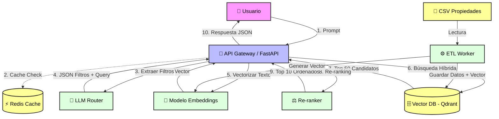
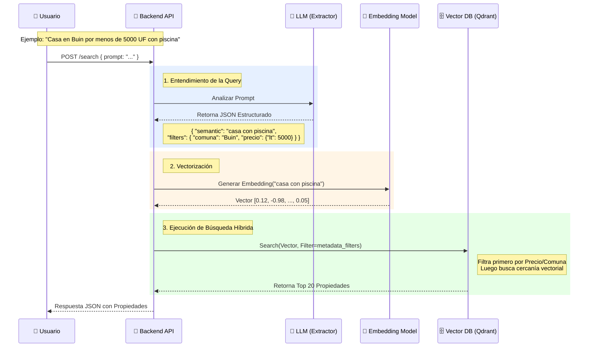
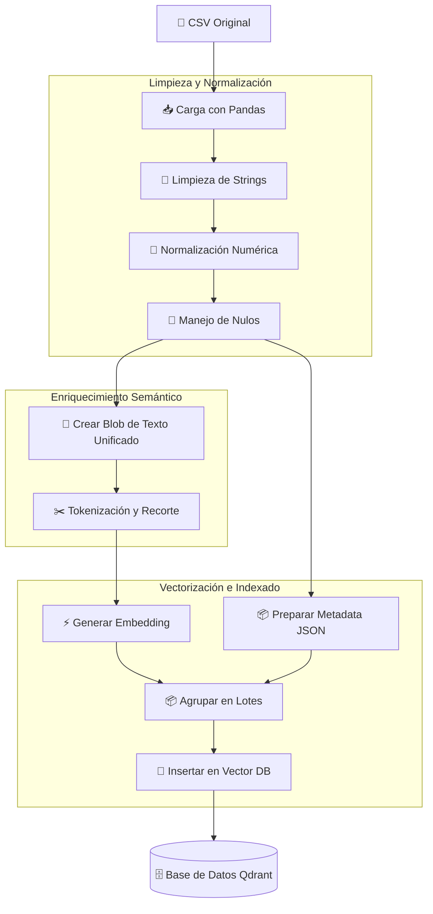

1. Arquitectura General del Sistema
Este diagrama muestra cómo interactúan los componentes principales: el usuario, la API, el cerebro (LLM) y el almacenamiento (Vector DB).

2. Flujo de Secuencia: Búsqueda Semántica
Este diagrama detalla paso a paso qué sucede cuando un usuario hace una búsqueda, destacando la separación entre la parte semántica y los filtros duros ("Hard Filters").

3. Pipeline de Ingesta de Datos (ETL)
Este diagrama es crucial para el equipo de ingeniería de datos. Muestra cómo transformar el CSV adjunto en vectores utilizables, manejando la limpieza de los campos sucios detectados.

